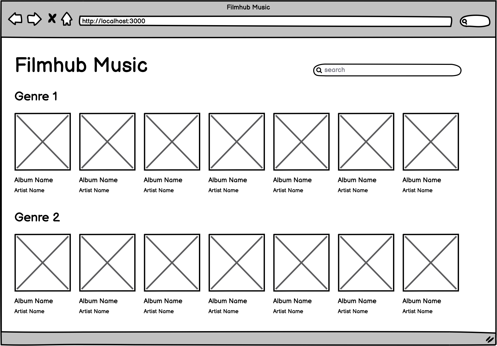

# Objective
Your assignment is to implement a music album dashboard using JavaScript and React.

## Brief
Your customers want to see which popular albums are being streamed, so naturally you roll up your sleeves and get to work. You quickly scribble down some notes and after a few hours of relentless work you have a design in mind.

## Tasks
Implement assignment using:
- Language: JavaScript
- Framework: NextJS (preferred) or plain React
- Connect your application to the Apple Music API at
https://rss.applemarketingtools.com/api/v2/us/music/most-played/50/albums.json
- Parse the API response and display the results as outlined in the design. Group albums by genres.
- Implement a detail view for the movies in the list
- Make sure that linking to detail pages as well as bookmarking works as expected
- Implement search by filtering the list by title

## Deliverables
Make sure to include all source code in the repository.

## Evaluation Criteria
- NextJS (if used), JavaScript and React best practices
- We're looking for you to produce working code, with enough room to demonstrate how to structure components in a small program.
- Show us your work through your commit history
- Completeness: did you complete the features?
- Correctness: does the functionality act in sensible, thought-out ways?
- Maintainability: is it written in a clean, maintainable way?
- Testing: is the system adequately tested?

### Submit
Please organize, design, test and document your code as if it were going into production - then submit by uploading a .zip archive.

All the best and happy coding,

The Filmhub Team
